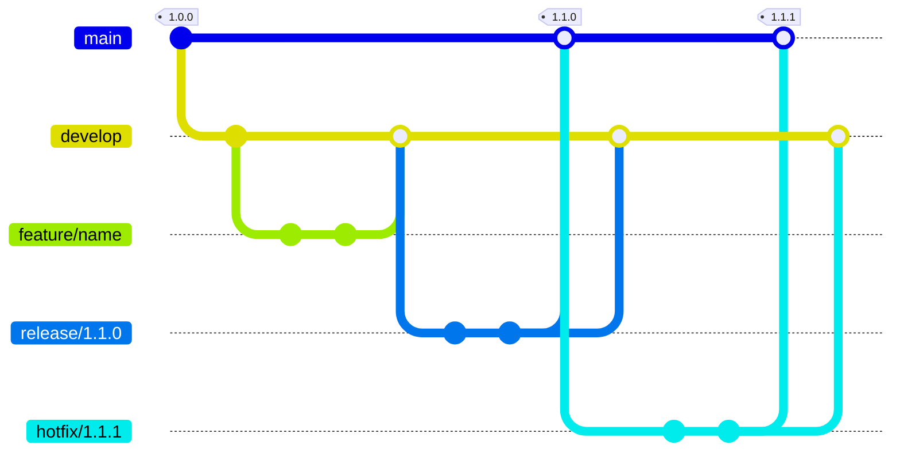
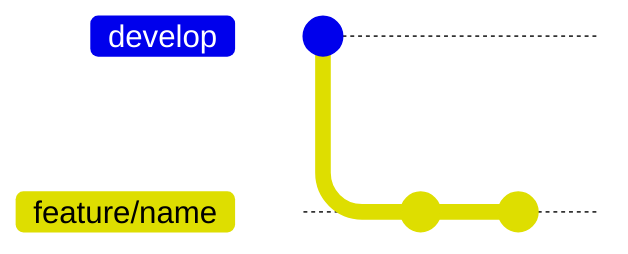
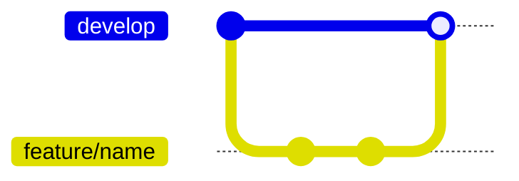
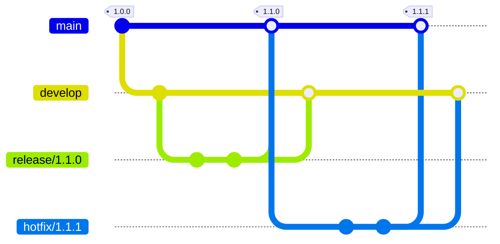
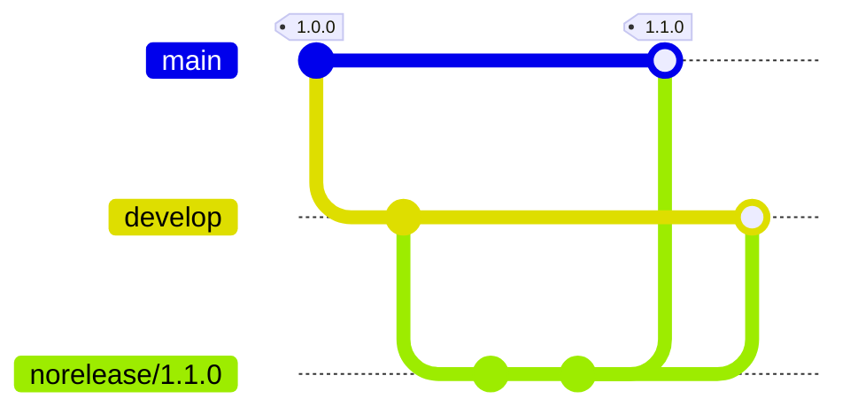

# gitflow

A implementation of workflows of GitHub Actions to support using gitflow on GitHub with branch protection rules and managing changelog.md.

## install

1. Create main, develop branch to repository.
2. Add branch protection rules of main, develop branch.
3. Add `.github/workflows/gitflow.yml` to repository.
    ```yml
    name: gitflow

    on:
      pull_request:
        types:
          - opened
          - synchronize
          - reopened
          - closed
        branches:
          - main
          - develop

    jobs:
      gitflow:
        uses: ab180/gitflow/.github/workflows/gitflow.yml@v2
        # with:
        #   MAIN_BRANCH: ... # Default: 'main'
        #   DEVELOP_BRANCH: ... # Default: 'develop'
        #   FEATURE_BRANCHES: ... # Default: 'feature refactor fix change update document test chore'
        #   RELEASE_BRANCHES: ... # Default: 'release hotfix'
        #   NORELEASE_BRANCHES: ... # Default: 'norelease'
        #   VERSION_EXPRESSION: ... # Default: '[0-9][0-9]*\.[0-9][0-9]*\.[0-9][0-9]*'
        #   VERSION_HEADER: ... # Default: '## '
        #   CHANGELOG: ... # Default: 'changelog.md'
        # secrets:
        #   GITHUB_TOKEN: ... # Default: GitHub Action token
        #   GITHUB_APP_ID: ... # Default: GitHub App ID for fetching GitHub token
        #   GITHUB_APP_PRIVATE_KEY: ... # Default: GitHub App ID for fetching GitHub token
        #   GITHUB_APP_OWNER: ... # Default: GitHub App ID for fetching GitHub token
    ```
4. Set `Workflow permissions` as checking `Read and write permissions` and `Allow GitHub Actions to create and approve pull requests`.
5. Do not check `Automatically delete head branches`.
6. Add `gitflow` to `Require status checks to pass before merging` of develop branch.
7. Add `gitflow` to `Require status checks to pass before merging` of main branch.

## usage



### When start new feature



```diff
changelog.md
---
+ ## Unreleased
+
+ - feature: ...
+
## 1.0.0
...
```

1. Create branch from develop branch.
2. Make branch name as `${FEATURE_TYPE}/name`.
3. Modify code.
4. Add `## Unreleased` to top of changelog.md when do not contains it.
5. Add description of feature to bottom of `## Unreleased` of changelog.md.
6. Commit and push.

### When finish feature



```
changelog.md
---
## Unreleased

- feature: ...

## 1.0.0
...
```

1. Create (`${FEATURE_TYPE}/name` to `develop`) pull request.
2. GitHub Actions automatically check changelog.md has `## Unreleased`, if possible add `## Unreleased` to changelog.md and commit and push, if not close pull request.
3. GitHub Actions automatically check changelog.md has modification, if not add recommend comment to pull request.
4. Merge.
5. GitHub Actions automatically delete `${FEATURE_TYPE}/name` branch.

### When start new release or hotfix


```diff
changelog.md
---
+ ## 1.1.0
- ## Unreleased
...
## 1.0.0
...
```

1. Create branch from develop branch.
2. Make branch name as `${RELEASE_TYPE}/0.0.0`.
3. Modify code to change version.
4. Modify `## Unreleased` to `## 0.0.0` of changelog.md.

### When finish release or hotfix



```diff
changelog.md
---
## 1.1.0
...
## 1.0.0
...
```

1. Create (`release/0.0.0` or `hotfix/0.0.0` to `main`) pull request.
2. GitHub Actions automatically check branch has valid name, if not close pull request.
3. GitHub Actions automatically check changelog.md has `## 0.0.0` and content of `## 0.0.0`, if not close pull request.
4. Merge.
5. GitHub Actions automatically create `0.0.0` tag and release.
6. GitHub Actions automatically append changelog.md's content of `## 0.0.0` to release note.
7. GitHub Actions automatically append result of GitHub's generate release note feature to release note.
8. GitHub Actions automatically merge `release/0.0.0` or `hotfix/0.0.0` branch to `develop` branch.
9. GitHub Actions automatically delete `release/0.0.0` or `hotfix/0.0.0` branch.

### When finish norelease



1. Create (`{NORELEASE_TYPE}/0.0.0` to `main`) pull request.
2. Merge.
3. GitHub Actions automatically merge `{NORELEASE_TYPE}/0.0.0` branch to `develop` branch.
4. GitHub Actions automatically delete `{NORELEASE_TYPE}/0.0.0` branch.
